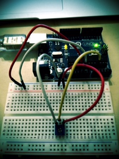

bubble_arduino
==============

  

## preparation  
#### write standardFirmata    
require: standardFirmata  
  
write standardFirmata to Arduino in ArduinoIDE  

#### move project

move this project into 'apps/myApps' directory in oF project  
ex. of_v0.8.0_osx_release/apps/myApps

## wiring  

